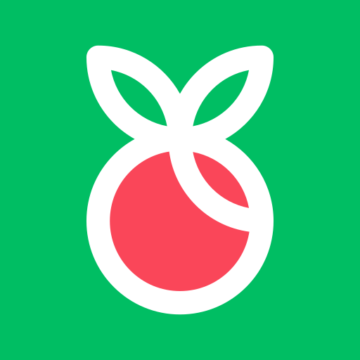

# Fructus App

  
  

<h1></h1>

  
  
  

 
> Trata-se de uma enciclopédia sobre frutas, a qual contém diversas informações acerca destes alimentos, incluindo as respectivas tabelas nutricionais.

  
  

## 💻️ Techs
- [SwiftUI](https://developer.apple.com/xcode/swiftui/)

## Autor

👤 **Lucas Castro**

* Website: https://github.com/LucasAugustoCastro
* Github: [@LucasAugustoCastro](https://github.com/LucasAugustoCastro)
* LinkedIn: [@https:\/\/www.linkedin.com\/in\/lucasaugustocastro\/](https://linkedin.com/in/https:\/\/www.linkedin.com\/in\/lucasaugustocastro\/)

## Montre seu apoio

Dê uma ⭐️ se o projeto ajudou você!

## 📝 License

Copyright © 2020 [Lucas Castro](https://github.com/LucasAugustoCastro). 
This project is [MIT](https://github.com/LucasAugustoCastro/GoBarberGoStack/blob/master/LICENSE) licensed.
